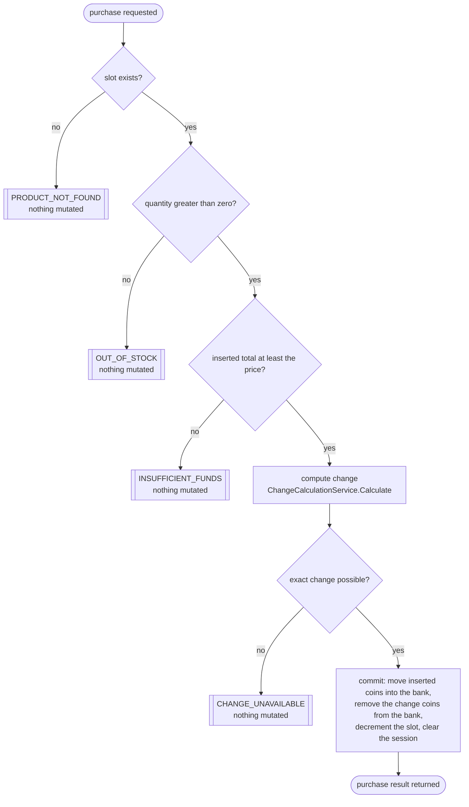
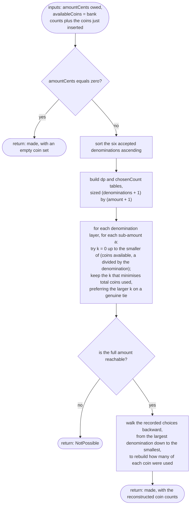

# Change calculation

Where the change calculator sits in a purchase, what it actually computes, and
why it is a search rather than a greedy pick — read directly from
`VendingService.Purchase` and `ChangeCalculationService.Calculate`.

## Part A — where it sits: the purchase sequence

The four checks below run in this exact order, and **nothing about the
machine's state changes until all four have passed**. That ordering — find
slot, check stock, check funds, compute change, only then commit — is why a
refused purchase never needs a rollback: if any check fails, the method has
simply not mutated anything yet.

Every refusal box is reached strictly before `G` — the only node in this
diagram where state changes. This ordering is the single most important
correctness property in the backend: because the mutation is the last step
and only runs once every check upstream of it has succeeded, a failed
purchase is a no-op by construction, and no rollback code exists anywhere in
this path.

## Part B — the algorithm: bounded coin-change by dynamic programming

The coin bank holds a *finite* count of each denomination, and the coins the
customer just inserted are added to what's available before this runs — so
the calculator is searching a bounded set, not an infinite float.

The ascending sort matters for the tie-break: it puts the largest denomination
last in the fill, so by the time the algorithm decides how many 200c coins to
use, it already knows the true optimal cost of every smaller remainder —
letting "prefer more of this denomination on a tie" favour large coins
correctly instead of arbitrarily.

## Part C — why not greedy

The calculator's own comment documents this exact counterexample: making 60c
from a bank of **one 50c coin and three 20c coins**.

| Step | Greedy (largest first) | Bounded DP |
| --- | --- | --- |
| First move | Takes the one 50c coin — the largest that fits | Searches all combinations the bank can actually pay |
| Remainder owed | 10c | — |
| Coins left to cover it | None — the bank has no 10c or 5c coins | — |
| Outcome | **Fails** — reports change impossible | **Succeeds** — three 20c coins, exact |

Greedy is optimal for the euro denominations only under an *unlimited* supply
of each coin; a real machine's bank is finite, so taking the locally-largest
coin can strand the remainder, and the algorithm has to search instead.

## Complexity, and why the simple DP was chosen

For each of the six denominations and every sub-amount from `0` up to the
amount owed, the fill step tries every count of that denomination up to what
fits and what's available — worst case `O(denominations × amount²)`,
dominated by the smallest denomination (5c), whose inner loop can run up to
`amount / 5` times. At this problem's actual scale — six fixed denominations,
purchases needing at most a few hundred cents of change, coin counts in the
low hundreds — that is nowhere near a scale where the quadratic term matters:
the calculator's own performance test measures 500c of change against a
200-coin bank at a few milliseconds, comfortably under its 50ms budget. A
faster approach (for example, binary/power-of-two splitting each
denomination's available count to shrink the inner loop to logarithmic) would
earn its complexity at a much larger scale, but here it would only make the
algorithm harder to verify by reading it — correctness-by-inspection is worth
more than headroom this domain will never need.
