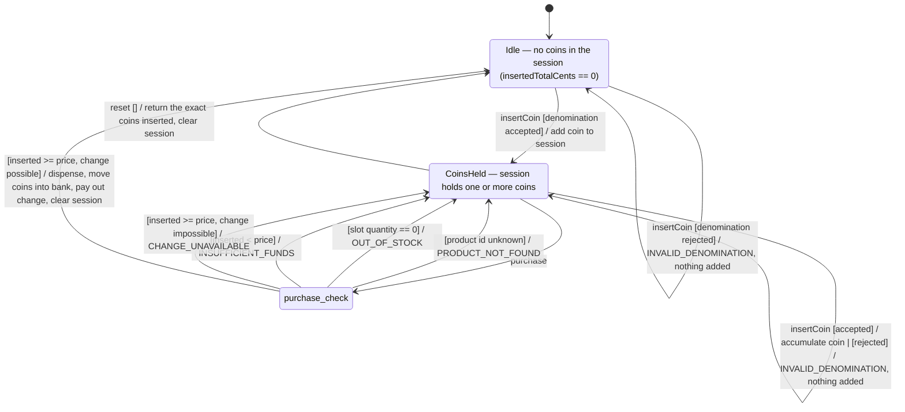

# Vending state machine

What the machine actually does when a customer inserts coins, buys a product,
or asks for their coins back — read directly from `VendingService` (insert
coin, purchase, reset) and the `ErrorCodes` it throws. **Product CRUD
(create/update/delete/reload) is a separate concern and is excluded from this
diagram** — see `ProductService`/`ProductValidationService` instead.

Every transition below is labelled `event [guard] / effect`, held to
consistently throughout — with one adaptation: `purchase` has four possible
outcomes from the same state, so the event fires into a `purchase_check`
decision point and each guarded outcome is labelled from there as `[guard] /
effect` (the leading `purchase` is implied by having just come through the
decision point). This is not just a stylistic choice — Mermaid's
`stateDiagram-v2` renderer silently drops every self-loop on a state except
the *last one defined*, so four separate `CoinsHeld → CoinsHeld` self-loops
for `purchase`'s four outcomes would render as one (verified with
`@mermaid-js/mermaid-cli`; see the note at the bottom of this file). Routing
through a real decision node avoids that renderer bug while keeping every
outcome its own labelled edge.

## States

- **Idle** — the session is empty; nothing has been inserted since the last
  purchase or reset.
- **CoinsHeld** — the session holds one or more coins, whose sum is
  `insertedTotalCents`. This money belongs to the customer until a purchase
  commits or a reset returns it.

## Error codes (vending flow only)

| Code | Triggered by | What the machine does |
| --- | --- | --- |
| `INVALID_DENOMINATION` | `insertCoin` with a value outside the accepted set (`5, 10, 20, 50, 100, 200`) | Rejects the coin outright — it is never added to the session, and the session's total is unchanged. |
| `PRODUCT_NOT_FOUND` | `purchase` for a product id with no matching slot | Refuses the purchase. Checked first, before stock or funds. |
| `OUT_OF_STOCK` | `purchase` for a slot whose `Quantity == 0` | Refuses the purchase. Checked before funds, so an out-of-stock item is reported as such even if funds are also insufficient. |
| `INSUFFICIENT_FUNDS` | `purchase` where `insertedTotalCents < priceCents` | Refuses the purchase; the shortfall is not disclosed as a coin breakdown, only that more is owed. |
| `CHANGE_UNAVAILABLE` | `purchase` where funds are sufficient but the bounded change calculator cannot make exact change from bank + inserted coins | Refuses the purchase. Nothing is dispensed and no coins move. |

## Why refusals preserve the session

`VendingService.Purchase` runs all four checks — product exists, in stock,
funds sufficient, change computable — before it touches any state; a
`DomainException` from any check exits the method immediately, so there is
nothing to undo and the session's coins are simply still there afterwards,
exactly as the customer left them.

## Transitions the code allows that this diagram simplifies away

- **`purchase` from `Idle`.** There is no guard requiring the session to hold
  money before attempting a purchase — calling `purchase` from `Idle`
  (`insertedTotalCents == 0`) is a real, reachable code path. It can still
  yield `PRODUCT_NOT_FOUND` or `OUT_OF_STOCK` (both checked before funds),
  and otherwise always yields `INSUFFICIENT_FUNDS` (since `0 < priceCents` for
  every valid product) — every one of them an `Idle → Idle` no-op, since there
  was nothing in the session to lose. `CHANGE_UNAVAILABLE` cannot happen from
  `Idle`: it only arises once change is owed, which requires
  `insertedTotalCents > priceCents`. Wiring `Idle` into the same
  `purchase_check` decision point would be mechanically easy, but it would add
  three more edges to document a case that is, by definition, uninteresting
  (nothing was at stake, nothing changes) — so it is reported here instead of
  drawn.
- **`reset` from `Idle`.** `VendingService.ResetAsync` has no guard either; it
  can be called with an empty session and simply returns an empty coin list
  and a total of `0`. Real, but a true no-op, so it is described here rather
  than drawn as a third state or a distracting extra self-loop.

## A Mermaid rendering limitation this diagram had to design around

`stateDiagram-v2` collapses multiple self-loop transitions on the *same*
state down to only the last one defined in source order — confirmed with a
minimal reproduction rendered through `@mermaid-js/mermaid-cli` (three
`A --> A` self-loops with distinct labels rendered as one). It does **not**
affect multiple edges between two *different* states, even when they share
the same source and target repeatedly. That is why `purchase`'s four outcomes
route through the `purchase_check` choice pseudostate (each outcome is then
`purchase_check → CoinsHeld`/`Idle`, never a self-loop) instead of being drawn
as four direct `CoinsHeld → CoinsHeld` arrows, and why `insertCoin`'s two
outcomes while `CoinsHeld` are combined onto one self-loop with a single
`|`-separated label instead of two separate arrows. Every rendered SVG was
inspected for the actual text content, not just a clean exit code, precisely
because this failure mode produces no error and no warning — it just quietly
throws diagram content away.
