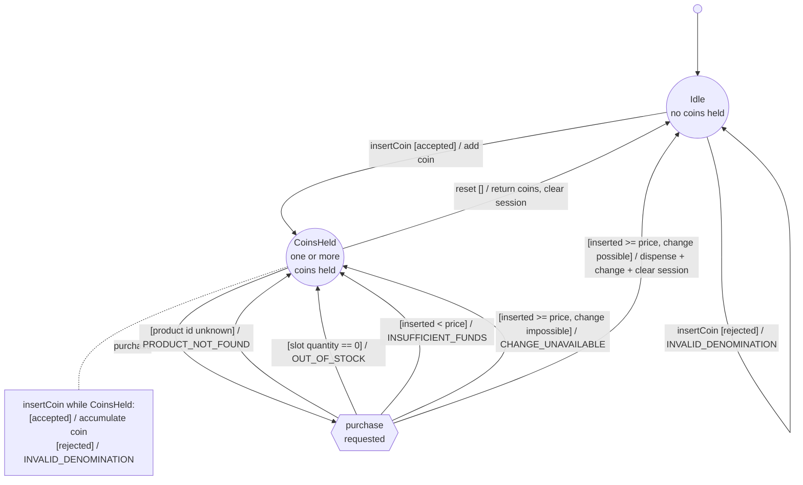

# Vending state machine

What the machine actually does when a customer inserts coins, buys a product,
or asks for their coins back — read directly from `VendingService` (insert
coin, purchase, reset) and the `ErrorCodes` it throws. **Product CRUD
(create/update/delete/reload) is a separate concern and is excluded from this
diagram** — see `ProductService`/`ProductValidationService` instead.

Drawn as a classic finite-state-automaton graph rather than a UML statechart:
states are circles, the one branching decision is a diamond, and every edge
is a directed, individually labelled arrow — chosen after an earlier
statechart-style version packed labels so tightly some of them overlapped
illegibly (see the note at the bottom for why, and what changed).

Every transition is labelled `event [guard] / effect`, held to consistently
throughout — with one adaptation: `purchase` has five possible outcomes from
the same state, so the event fires into a `purchase requested` decision point
and each guarded outcome is labelled from there as `[guard] / effect` (the
leading `purchase` is implied by having just come through the decision
point).

The dotted line to `insertCoin while CoinsHeld` is not a state transition —
it is an annotation. Inserting a coin while `CoinsHeld` never changes which
state you're in (you were already in `CoinsHeld` and you still are), only
what the session holds, so it is documented as a note beside the state
rather than drawn as a loop back onto an already busy node.

## States

- **Idle** — the session is empty; nothing has been inserted since the last
  purchase or reset.
- **CoinsHeld** — the session holds one or more coins, whose sum is
  `insertedTotalCents`. This money belongs to the customer until a purchase
  commits or a reset returns it.

## Error codes (vending flow only)

| Code | Triggered by | What the machine does |
| --- | --- | --- |
| `INVALID_DENOMINATION` | `insertCoin` with a value outside the accepted set (`5, 10, 20, 50, 100, 200`) | Rejects the coin outright — it is never added to the session, and the session's total is unchanged. |
| `PRODUCT_NOT_FOUND` | `purchase` for a product id with no matching slot | Refuses the purchase. Checked first, before stock or funds. |
| `OUT_OF_STOCK` | `purchase` for a slot whose `Quantity == 0` | Refuses the purchase. Checked before funds, so an out-of-stock item is reported as such even if funds are also insufficient. |
| `INSUFFICIENT_FUNDS` | `purchase` where `insertedTotalCents < priceCents` | Refuses the purchase; the shortfall is not disclosed as a coin breakdown, only that more is owed. |
| `CHANGE_UNAVAILABLE` | `purchase` where funds are sufficient but the bounded change calculator cannot make exact change from bank + inserted coins | Refuses the purchase. Nothing is dispensed and no coins move. |

## Why refusals preserve the session

`VendingService.Purchase` runs all four checks — product exists, in stock,
funds sufficient, change computable — before it touches any state; a
`DomainException` from any check exits the method immediately, so there is
nothing to undo and the session's coins are simply still there afterwards,
exactly as the customer left them. Every refusal arrow above lands back on
`CoinsHeld`, never `Idle` — the customer's money stays theirs.

## Transitions the code allows that this diagram simplifies away

- **`purchase` from `Idle`.** There is no guard requiring the session to hold
  money before attempting a purchase — calling `purchase` from `Idle`
  (`insertedTotalCents == 0`) is a real, reachable code path. It can still
  yield `PRODUCT_NOT_FOUND` or `OUT_OF_STOCK` (both checked before funds),
  and otherwise always yields `INSUFFICIENT_FUNDS` (since `0 < priceCents` for
  every valid product) — every one of them an `Idle → Idle` no-op, since there
  was nothing in the session to lose. `CHANGE_UNAVAILABLE` cannot happen from
  `Idle`: it only arises once change is owed, which requires
  `insertedTotalCents > priceCents`. Wiring `Idle` into the same `purchase`
  decision point would be mechanically easy, but it would add three more
  edges to document a case that is, by definition, uninteresting (nothing was
  at stake, nothing changes) — so it is reported here instead of drawn.
- **`reset` from `Idle`.** `VendingService.ResetAsync` has no guard either; it
  can be called with an empty session and simply returns an empty coin list
  and a total of `0`. Real, but a true no-op, so it is described here rather
  than drawn as a third state or a distracting extra self-loop.

## Why this isn't drawn as a UML statechart, and a Mermaid limitation behind that

The first version of this diagram used Mermaid's `stateDiagram-v2` (UML
statechart notation: rounded rectangles, a `<<choice>>` pseudostate for the
`purchase` branch) and read correctly in isolation, but rendered with several
edge labels overlapping illegibly once GitHub laid it out — `purchase`'s four
outcomes and `insertCoin`'s two both converged on the same small area next to
`CoinsHeld`.

Investigating why surfaced a real Mermaid bug, confirmed with a minimal
reproduction rendered through `@mermaid-js/mermaid-cli`: **both**
`stateDiagram-v2` **and** `flowchart` collapse multiple self-loop transitions
on the *same* node down to only the last one defined in source order, with no
error and no warning — three or even two `A --> A` edges with distinct
labels render as one. It does **not** affect multiple edges between two
*different* nodes, even when several share the same source and target. This
is why `purchase`'s five outcomes are drawn from a real decision node
(`purchase{{...}}`, never a self-loop) rather than as direct
`CoinsHeld → CoinsHeld` arrows, and why `insertCoin`'s two outcomes while
`CoinsHeld` are pulled out into the `coinNote` annotation instead of a second
self-loop on `CoinsHeld` — a *single* self-loop there was safe from the
collapsing bug, but still rendered squeezed against the four incoming
`purchase` arrows on the same node, which is what actually produced the
overlap. Moving to the automaton style (circles, a diamond, and an explicit
annotation node) gave the layout engine enough room to separate every label
cleanly.

Every rendered SVG was inspected for its actual text content, not just a
clean CLI exit code, precisely because this failure mode produces neither an
error nor a warning — it just quietly throws diagram content away or crowds
it into illegibility.
